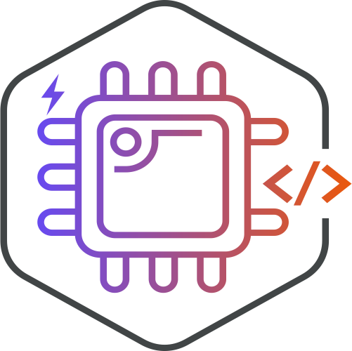
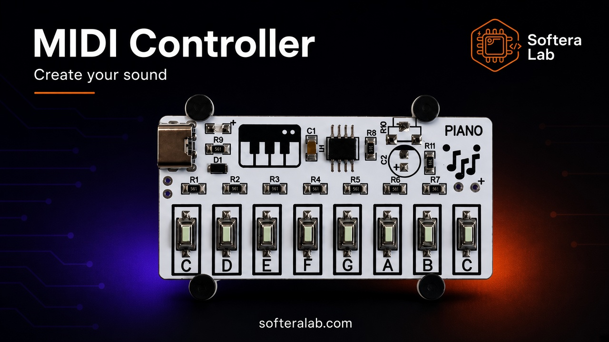
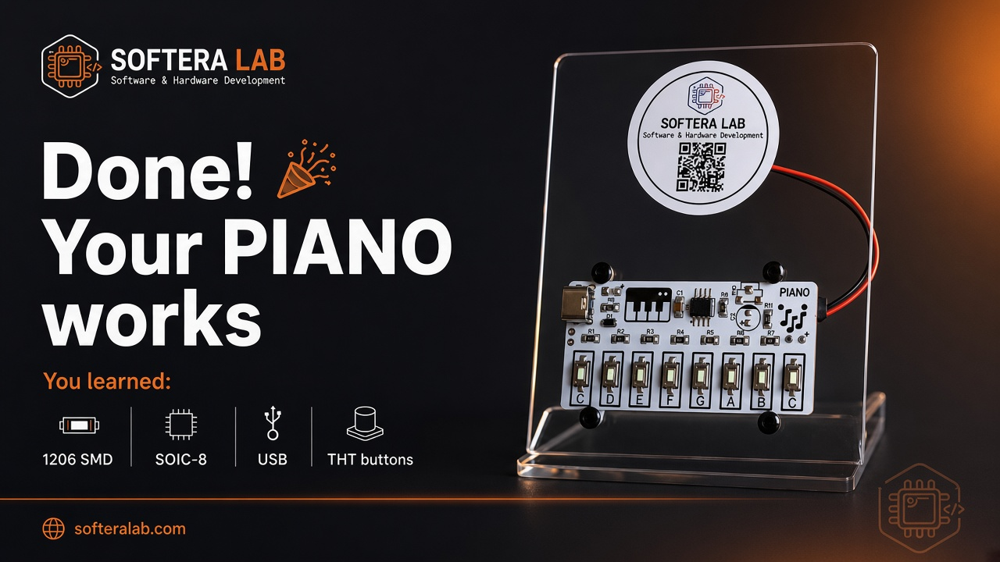

  

<h1 align="center">PIANO Solder Kit</h1>

<strong>Softera Lab MIDI / tone practice kit — solder 1206, SOIC-8, USB, and buttons</strong>

  
  
  
  
  

<strong>Languages:</strong> English (this page) · <a href="README.uk.md">Українська</a>

  

  

Softera Lab kit for practicing SMD and through-hole soldering on a real **musical keyboard board**. After assembly you get **8 note buttons** (**C–B–C**), USB power, a **3.5 mm headphone jack**, and optional speaker pads — listen on headphones without a speaker.

This is **not an open-source hardware project**. Manufacturing files are not published.

> © Softera Lab. All rights reserved.

## How it works

  

1. **USB** — 5 V power  
2. Press note buttons **C–B–C**  
3. **SOIC-8** MCU generates the tone  
4. Sound via **3.5 mm jack** (headphones) or speaker pads (**+** / **−**)  

## About the kit

| Zone | What you get |
| --- | --- |
| **Keys** | 8 × THT buttons — notes **C D E F G A B C** |
| **SMD practice** | Resistors / parts in **1206** |
| **MCU** | **SOIC-8** package |
| **Power** | USB connector, 5 V |
| **Protection** | Diode **D1** (polarity / rectification) |
| **Audio** | **3.5 mm jack** for headphones — no speaker required |
| **Speaker (optional)** | Pads **+** / **−** |

Step-by-step: [`docs/en/`](docs/en/).

## Specifications

| Parameter | Value |
| --- | --- |
| Product | PIANO Kit · Softera Lab |
| Keys | 8 buttons · notes C–B–C |
| Packages practiced | **1206**, **SOIC-8**, USB, THT buttons |
| Input | USB, 5 V |
| Audio out | **3.5 mm headphone jack** |
| Speaker | Optional pads **+** / **−** |
| Protection | Diode D1 |

## Assembly highlights

  

  

  

1. SMD passives (**1206**) and diode **D1** — stripe = cathode  
2. **SOIC-8** MCU — match pin 1  
3. USB connector  
4. THT buttons — align, then solder; check the click  
5. **3.5 mm jack** for headphones (convenient — works without a speaker)  
6. Optional speaker: **red → +**, **black → −**  
7. Power on → press **C–B–C**  

Full guide: [docs/en/02-getting-started.md](docs/en/02-getting-started.md).

  

## Links

| Item | Where |
| --- | --- |
| Ukrainian README | [README.uk.md](README.uk.md) |
| Board overview | [docs/en/01-hardware-overview.md](docs/en/01-hardware-overview.md) |
| Assembly | [docs/en/02-getting-started.md](docs/en/02-getting-started.md) |
| Soldering tips | [docs/en/03-soldering.md](docs/en/03-soldering.md) |
| Troubleshooting | [docs/en/04-troubleshooting.md](docs/en/04-troubleshooting.md) |
| Website | [softeralab.com](https://www.softeralab.com/) |
| Soldering course | [course page](https://www.softeralab.com/course-basic-soldering/) |
| Contact | [Contacts](https://www.softeralab.com/our-contacts/) · support@softeralab.com |
| Instagram | [instagram.com/softeralab](https://www.instagram.com/softeralab/) |
| YouTube | [youtube.com/@SofteraLab](https://www.youtube.com/@SofteraLab) |

## Copyright

© Softera Lab. All rights reserved.

Public materials may be viewed. You may not copy, manufacture, redistribute, or commercially use the board design without written permission from Softera Lab.
