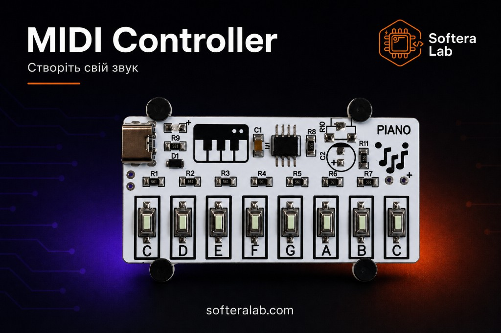
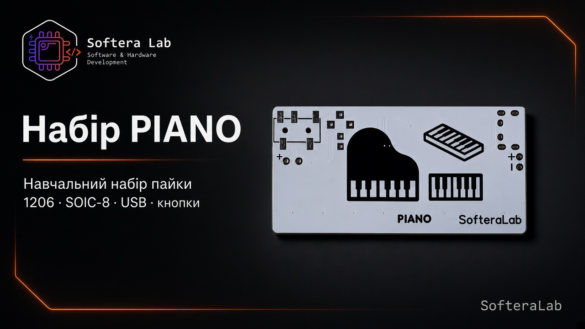
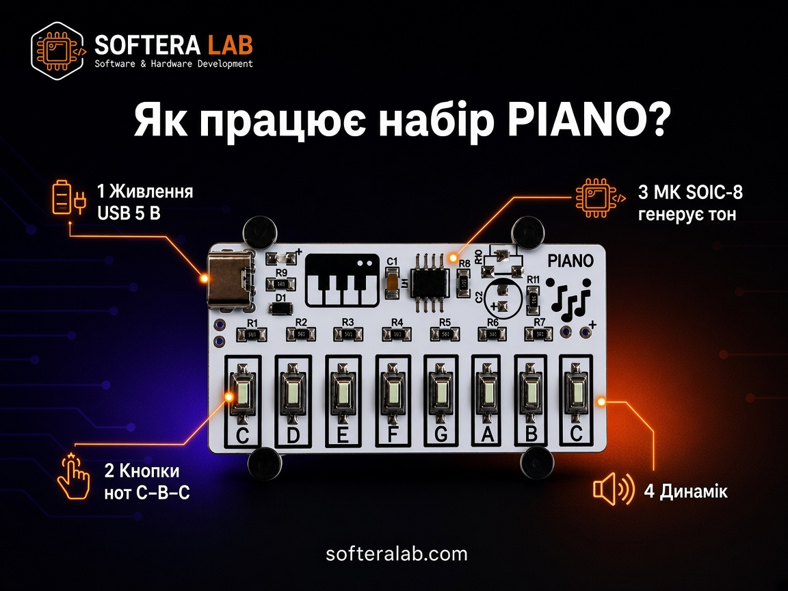
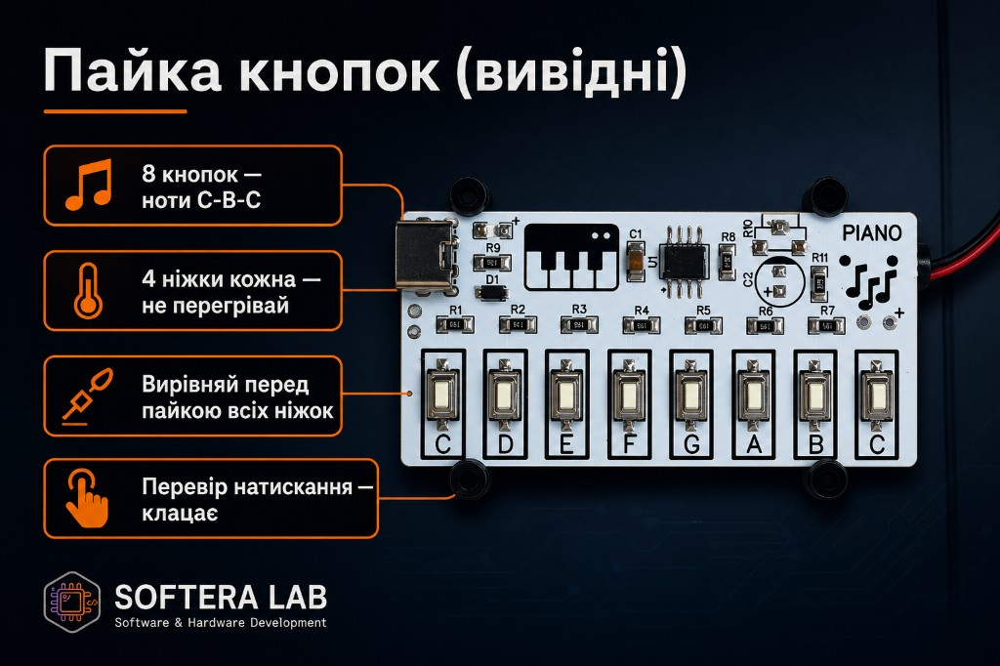
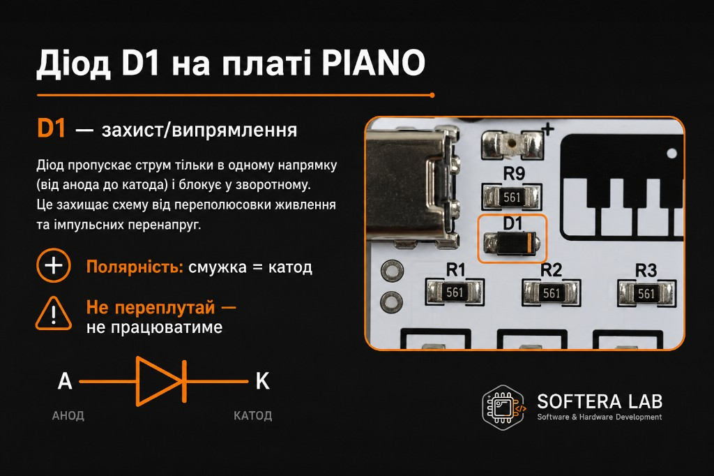
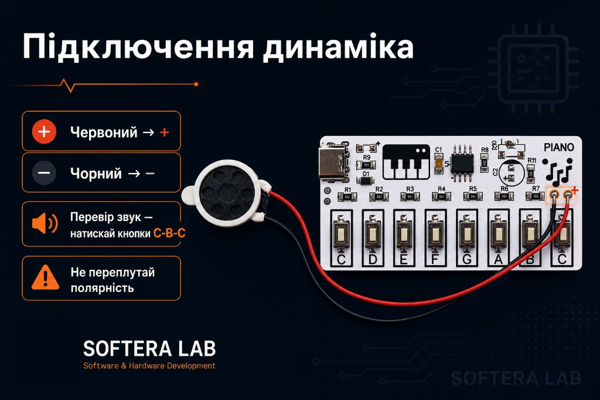
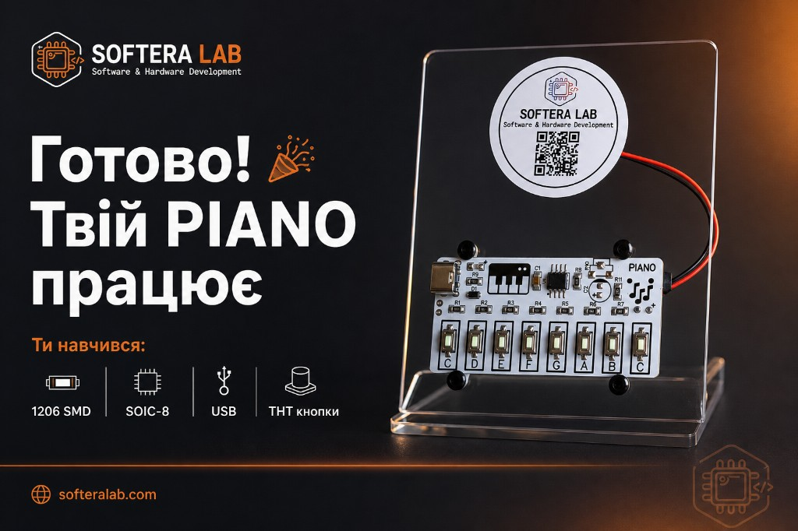

  

<h1 align="center">Набір PIANO</h1>

<strong>Навчальний MIDI / тон-контролер Softera Lab — пайка 1206, SOIC-8, USB і кнопок</strong>

  
  
  
  
  

<strong>Мови:</strong> <a href="README.md">English</a> · Українська (ця сторінка)

  

  

Набір Softera Lab для практики SMD і вивідної пайки на реальній **клавіатурі**. Після збірки — **8 кнопок-нот** (**C–B–C**), живлення USB, вихід **3,5 мм jack** на навушники і за бажанням динамік: слухати можна **без динаміка**.

Це **не open-source проєкт**. Виробничі файли публічно не викладаються.

> © Softera Lab. All rights reserved.

## Як працює

  

1. **USB** — живлення 5 В  
2. Натискайте кнопки нот **C–B–C**  
3. МК у корпусі **SOIC-8** генерує тон  
4. Звук через **jack 3,5 мм** (навушники) або площадки динаміка (**+** / **−**)  

## Про набір

| Зона | Що отримуєте |
| --- | --- |
| **Клавіші** | 8 × THT кнопок — ноти **C D E F G A B C** |
| **SMD-практика** | Резистори / деталі **1206** |
| **МК** | Корпус **SOIC-8** |
| **Живлення** | Роз’єм USB, 5 В |
| **Захист** | Діод **D1** |
| **Аудіо** | **Jack 3,5 мм** для навушників — динамік не обов’язковий |
| **Динамік (опційно)** | Площадки **+** / **−** |

Покроково: [`docs/`](docs/).

## Характеристики

| Параметр | Значення |
| --- | --- |
| Product | PIANO Kit · Softera Lab |
| Клавіші | 8 кнопок · ноти C–B–C |
| Що тренуємо | **1206**, **SOIC-8**, USB, THT-кнопки |
| Вхід | USB, 5 В |
| Аудіовихід | **Jack 3,5 мм** (навушники) |
| Динамік | Опційні площадки **+** / **−** |
| Захист | Діод D1 |

## Акценти збірки

  

  

  

1. SMD (**1206**) і діод **D1** — смужка = катод  
2. МК **SOIC-8** — ключ pin 1  
3. Роз’єм USB  
4. THT-кнопки — вирівняти, потім паяти; перевірити клацання  
5. **Jack 3,5 мм** для навушників (зручно — можна без динаміка)  
6. За бажанням динамік: **червоний → +**, **чорний → −**  
7. Увімкнути → натиснути **C–B–C**  

Повний гайд: [docs/02-getting-started.md](docs/02-getting-started.md).

  

## Посилання

| Пункт | Куди |
| --- | --- |
| English README | [README.md](README.md) |
| Огляд плати | [docs/01-hardware-overview.md](docs/01-hardware-overview.md) |
| Збірка | [docs/02-getting-started.md](docs/02-getting-started.md) |
| Пайка | [docs/03-soldering.md](docs/03-soldering.md) |
| Діагностика | [docs/04-troubleshooting.md](docs/04-troubleshooting.md) |
| Сайт | [softeralab.com](https://www.softeralab.com/) |
| Курс пайки | [сторінка курсу](https://www.softeralab.com/course-basic-soldering/) |
| Контакт | [Контакти](https://www.softeralab.com/our-contacts/) · support@softeralab.com |
| Instagram | [instagram.com/softeralab](https://www.instagram.com/softeralab/) |
| YouTube | [youtube.com/@SofteraLab](https://www.youtube.com/@SofteraLab) |

## Авторські права

© Softera Lab. All rights reserved.

Публічні матеріали можна переглядати. Копіювати, виробляти чи комерційно використовувати дизайн плати без письмового дозволу Softera Lab заборонено.
