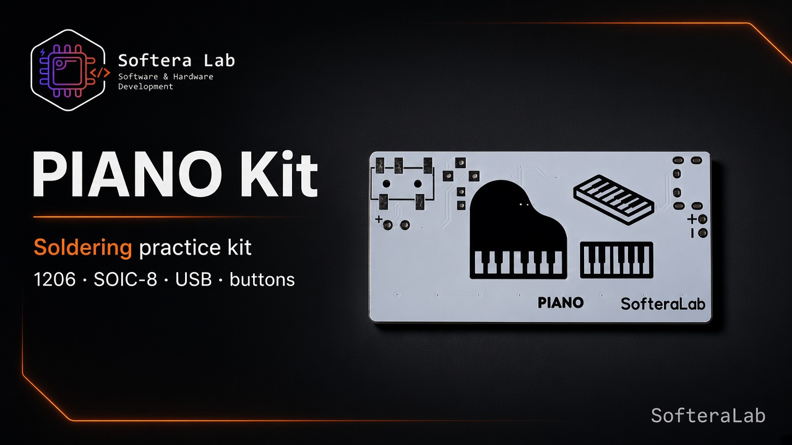

Build

# Assembly

  

## Suggested order

| Step | Action |
| --- | --- |
| 1 | SMD passives **1206** and diode **D1** |
| 2 | **SOIC-8** MCU — pin 1 mark |
| 3 | USB connector |
| 4 | THT buttons C–B–C |
| 5 | **3.5 mm headphone jack** |
| 6 | Optional speaker wires **red → +**, **black → −** |
| 7 | USB power → press keys → check sound (headphones or speaker) |

:::caution Diode D1
Stripe = cathode. Wrong orientation blocks the board.
:::
