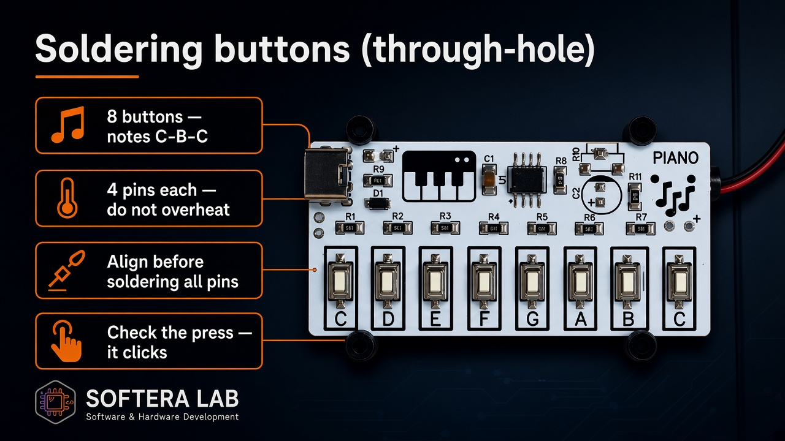
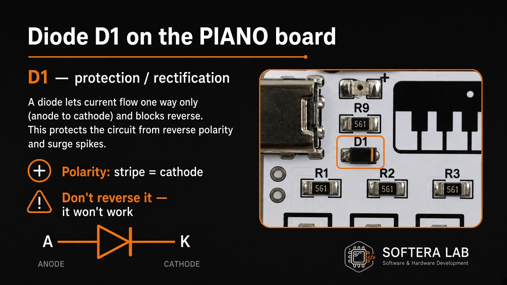
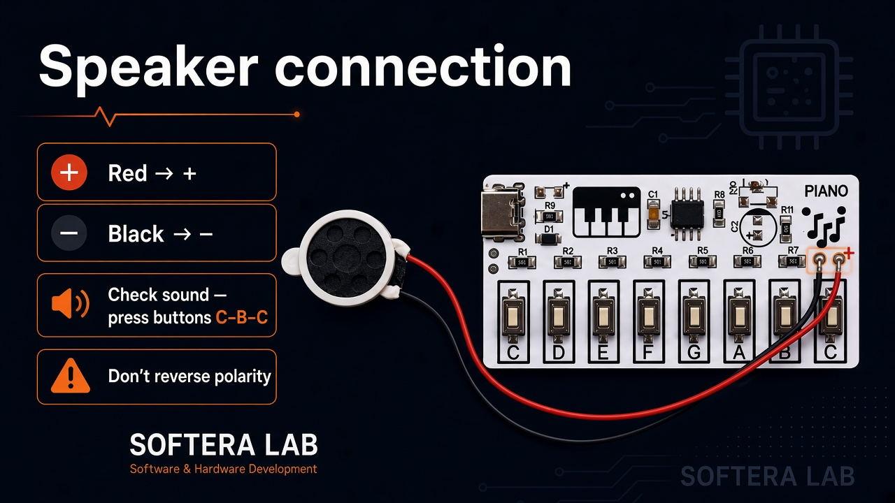

Soldering

# Soldering tips

## Through-hole buttons

- 8 buttons — notes **C–B–C**  
- 4 pins each — do not overheat  
- Align before soldering all pins  
- Check the press — it clicks  

## Diode D1

Polarity: **stripe = cathode**. Don’t reverse it.

## Speaker (optional)

Prefer the **3.5 mm jack** for headphones — no speaker needed. If you use a speaker:

- **Red → +**  
- **Black → −**  
- Check sound on **C–B–C**  
